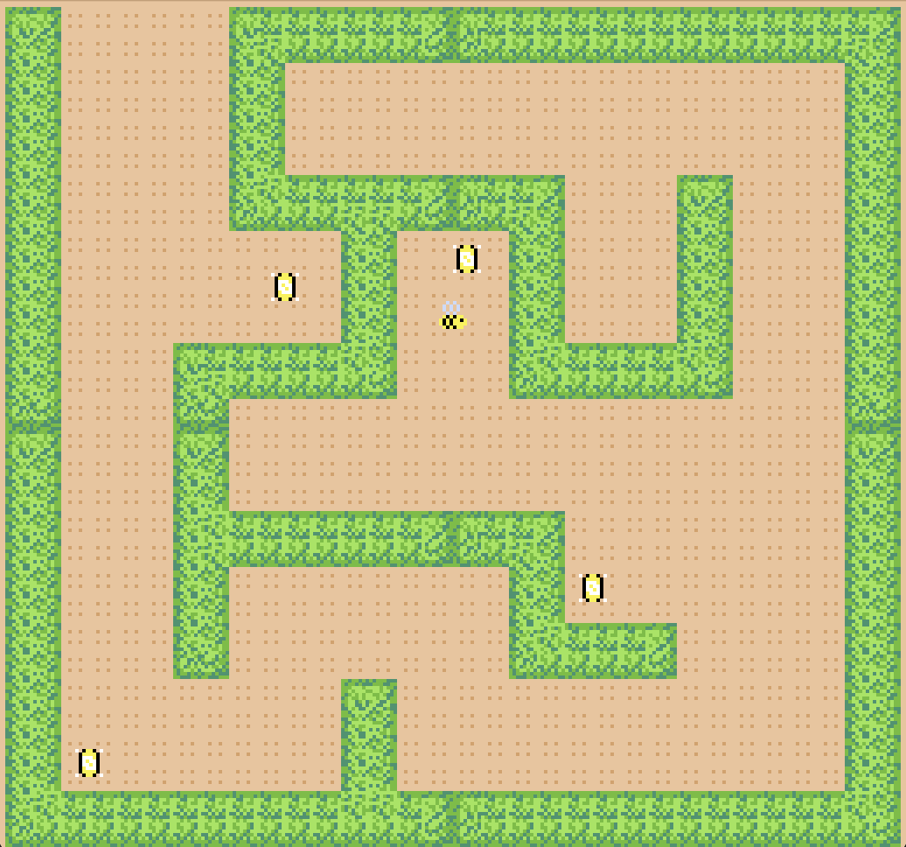

# The A-Maze-ing Bee

**Author:** Nellie Tonev

**Design:** In *The A-Maze-ing Bee*, you play as a bee wandering through a maze looking for flowers to pollinate. 
However, flowers in the maze are not immediately visible - you first need to find helpful light items scattered around that will 
illuminate part of the maze and guide you toward your goal. 

**Screen Shot:**

\
**How Your Asset Pipeline Works**:

All PNG images in the game were created by me, using [Aesprite](https://www.aseprite.org/).
Individual tiles and sprites are loaded from pngs and processed into PPU466 tiles during startup of the game. 

The background tiles are the [ground](assets/ground.png) and 9 unique [maze tiles](assets/maze-tiles.png) stored in and processed from a spritesheet. 
Meanwhile, the currently implemented foreground sprites are the player's [bee](assets/bee-default.png) character and the [light object](assets/light.png).

The functions I wrote to process the individual 8x8 png images and spritesheet into tiles (with more details and restrictions for their use) can be found [here](asset_pipeline.hpp).

Additionally, I created a [palette table reference png](assets/palette_table_data.png) with 8 rows of 4 colors, which represents and visually maps to the palette table used during runtime.
I read from this file to populate the palette table before processing any other tiles/sprites and then, since I know which palette each sprite will use, I am able to use 
the converted palette table data to find the color indices of each bit in the tiles.

As for the data used to set up the maze layout, this gets processed as part of the authoring process (before runtime) from a simple [png file mapping out where the maze walls will be located](assets/level-layout.png) to 
a [binary file](dist/assets/level-layout.bin) storing chunks of data that indicate, for each quadrant of the screen, where there is a maze wall vs. regular ground. This function is also described in the [asset_pipeline](asset_pipeline.hpp) file. 
Then, during runtime, after processing all the unique tiles, I use this binary data to populate the background with tiles to match the layout drawing. For each maze wall tile, I also take into consideration the surrounding tiles, in order 
to determine which of the 9 sprites to draw (e.g. if it is a corner of the wall). 

\
**How To Play:**

Move your bee character around using the arrow keys. If you are close enough to a light object, click 'E' to interact with it.
This will "illuminate" its corresponding quadrant of the screen, changing the color of the maze wall. Click 'Q' to quit the game at any point.

If I had more time to implement the game mechanics, the illumination step would have also revealed locations of any flowers in 
that quadrant. Then, you would be able to interact with the flowers and move pollen from one to another. Additionally, I would like for
the light objects to only reveal themselves to the player when you move closer to them, so it's not extremely obvious exactly where you need to go right from the start.

You may also notice while playing this game that the maze walls have no colliders on them, so you can fly right through them. 
As of the point of submitting this assignment, I am still dealing with some very confusing bugs related to my collision system. So, to have some kind of
an actual working game to submit, I have just commented out all collision logic for now.

Thanks for playing :)

\
This game was built with [NEST](NEST.md).

